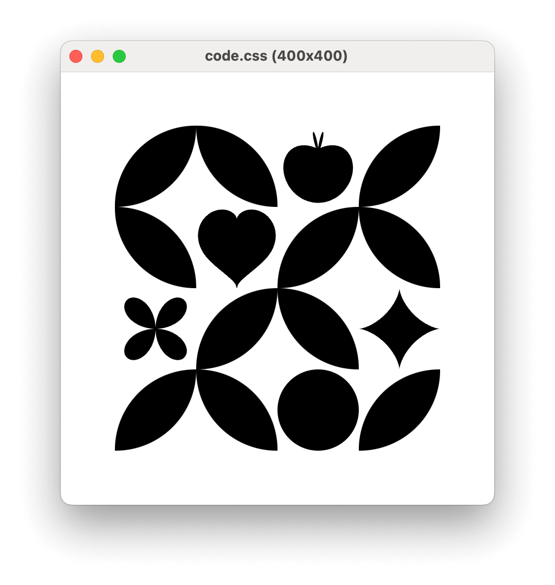

# @css-doodle/cli

The css-doodle CLI for previewing and generating images.



## Installation

```bash
npm install -g @css-doodle/cli
```

## Commands 

### render
Generate an image from the CSS Doodle source file.

```bash
$ css-doodle render code.css
```

#### -o, --output

Custom output filename of the generated image.

```bash
$ css-doodle render code.css -o result.png
```

#### -x, --scale

Scale factor of the generated image, defaults to 1.

```bash
$ css-doodle render code.css -x 4
```

### preview
Open a window to preview the CSS Doodle file.

```bash
$ css-doodle preview code.css
```

#### --fullscreen

Open the preview in fullscreen mode.

```bash
$ css-doodle preview code.css --fullscreen
```


### config

Display/set the configuration.

```bash
$ css-doodle config
```

#### browserPath

Use a custom browser to preview and generate images.

```bash
$ css-doodle config browserPath /Applications/Google\ Chrome.app/Contents/MacOS/Google\ Chrome
```

## Usage

```
Usage: css-doodle [options] [command]

The css-doodle CLI for previewing and generating images

Options:
  -V, --version                  output the version number
  -h, --help                     display help for command

Commands:
  render [options] <source>      generate an image from the CSS Doodle source file
  preview [options] <source>     open a window to preview the CSS Doodle file
  parse <source>                 print the parsed tokens, helped to debug on development
  config                         display/set the configuration
  help [command]                 display help for command
```

