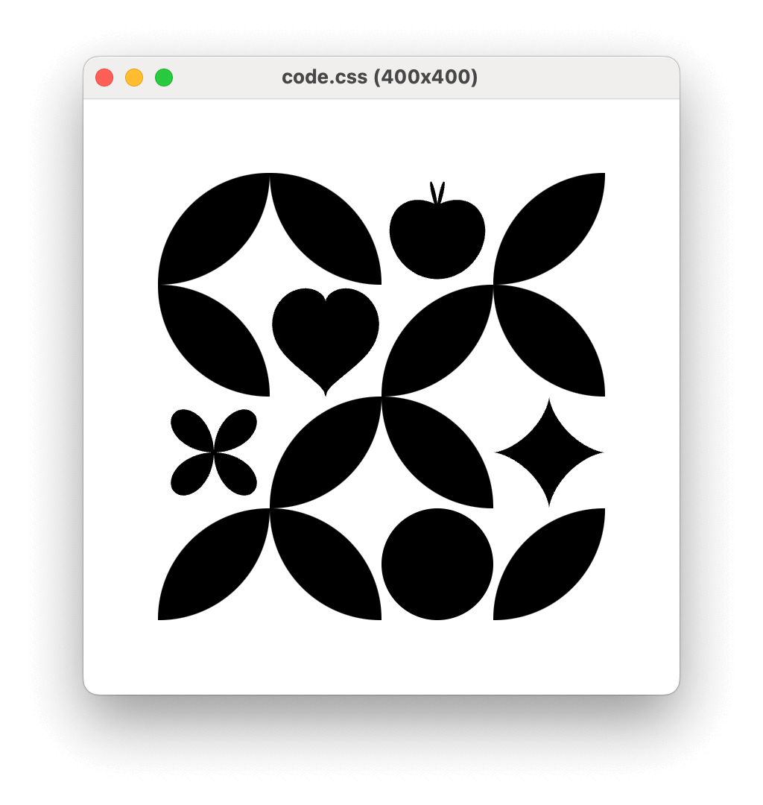

# @css-doodle/cli

Command-line tool for css-doodle to preview and generate images/videos.



## Installation

```bash
npm install -g @css-doodle/cli
```

> [!NOTE]
> Once installed, you can use either `cssd` or `css-doodle` command in the terminal.

## Usage

```console
Usage: cssd [options] [command]

Options:
  -V, --version  output the version number
  -h, --help     display help for command

Commands:
  run            Open a window to preview the css|cssd file, default command
  render         Generate an image from a css/cssd/html file, css-doodle or CodePen link, or http(s) URL
  gen            Generate code using css-doodle generators
  config         Display/set configurations
  use            Shorthand to fetch and use a custom version of css-doodle
  parse          Print the parsed tokens, help to debug in development
  update         Update CLI to latest version
```

## Commands

### run

Open a window to preview the css-doodle source file. The source file can be a `.css` or `.cssd` file, or a css-doodle link.

- `--fullscreen`: Open in fullscreen mode.
- `--seed <seed>`: Seed for the random functions, to get a reproducible result.
- `--show-fps-counter`: Show fps counter overlay.
- `--show-paint-rects`: Show paint rects overlay.

```bash
cssd run code.css
cssd run code.css --fullscreen
cssd preview code.css
```

The `run` can be omitted if you just want to preview.

```bash
cssd somefile.css
```

### render

Generate an image/video from the css-doodle source file. The source file can be a `.css`, `.cssd`, `.html` file, css-doodle link (`https://css-doodle.com/d/:id`), CodePen link, or http(s) URL.

- `-o, --output <output>`: Custom output filename of the generated result, missing directories are created
- `-x, --scale <scale>`: Scale factor of the generated result, defaults to `2` for images, `1` for videos
- `-s, --selector <selector>`: CSS selector to target the rendered node, defaults to `css-doodle`. Reports an error if no element matches
- `-d, --delay <delay>`: Delay time before taking screenshot/screencast, e.g, `2s`, maximum `30s`
- `-t, --time <time>`: Record screen for a specific time, e.g, `10s`, maximum `60s`
- `-q, --quiet`: Quiet mode, suppresses non-error output
- `-w, --window <size>`: The size of the rendered window, defaults to `1600x1000` for images, `1200x800` for videos
- `-f, --format <format>`: Output format, `png|webp|jpeg` for images, `mp4` for videos (`gif|webm` are deprecated)
- `-y, --yes`: Overwrite the output file if it already exists without prompting
- `--seed <seed>`: Seed for the random functions, to reproduce a result (only for css-doodle source code)

```bash
cssd render
cssd render code.css
cssd render code.css -o result.png
cssd render code.css -o result.png -y
cssd render code.css -x 4
cssd render code.css --seed 1702
cssd render https://css-doodle.com/d/R3WhVB20fJ9fbZ1L
cssd render https://codepen.io/yuanchuan/pen/MQEeJo
cssd render <<< '@grid: 3/400px; background: @p(red, blue)'
```

Without `-o`, the output filename includes the seed of the doodle (e.g. `code-1702.png`), so you can pass it back with `--seed` to render the same
result again.

Time values accept `ms`, `s`, or `m` units and decimals, e.g. `500ms`, `1.5s`, `1m`. A number without unit is in milliseconds.

Screen recording:

```bash
cssd render -t 10s
```

If the output filename ends with `.png`, `.webp`, or `.jpeg`, it will generate an image; if it ends with `.mp4`, it will generate a video. If no
output filename is specified, you can use the `-f` option to specify the output format. By default, it will generate a PNG image.

Videos are recorded by the browser as AV1-encoded MP4. The `.gif` and `.webm` formats are deprecated and require [ffmpeg](https://ffmpeg.org).

```bash
cssd render code.css -o result.mp4
cssd render code.css -o result.png

# png
cssd render code.css
# webp
cssd render code.css -f webp
```

### gen

Generate code using css-doodle generators.

- `svg`: Generate SVG code using svg() function.
- `polygon`: Generate CSS polygon() using shape() function.

- `--seed <seed>`: Seed for the random functions in `svg`, to get a reproducible result (requires css-doodle 0.53.0 or later).

```bash
cssd gen svg <<< 'svg {}'
cssd gen svg code.css
cssd gen svg code.css --seed 1702
cssd gen polygon code.css
cssd generate svg code.css

# read from STDIN
cssd gen polygon
```

### config

Display/set the configurations in key/value pairs.

- `set <field> <value>`: Set a configuration with key/value pair.
- `get <field>`: Get a configuration value by key.
- `unset <field>`: Unset a configuration field.
- `list`: List all configurations.

Recognizable `field` configurations:

- `browserPath` (or `browser-path`, `executablePath`, `executable-path`): The path to the browser executable.
- `css-doodle`: The path to the css-doodle to use, or a version number like `0.40.6` or `latest`.

```bash
# show all configurations
cssd config list

# use a custom browser
cssd config set browserPath /Applications/Google\ Chrome.app/Contents/MacOS/Google\ Chrome

# unset
cssd config unset browserPath

# get the value
cssd config get browserPath

# download and use a custom version of css-doodle
cssd config set css-doodle 0.40.6

# use a local css-doodle file
cssd config set css-doodle /path/to/css-doodle.min.js
```

### use

Shorthand of `cssd config set css-doodle <version>`.

- `<version>`: The version of css-doodle to use. It can be a specific version or `latest`.

```bash
cssd use css-doodle@0.40.6

# or just version
cssd use 0.40.6
cssd use latest
```

### parse

Print the parsed tokens, useful for debugging css-doodle code in development.

```bash
cssd parse code.css
cssd parse <<< '@grid: 3/400px; background: @p(red, blue)'
```

### update

Update CLI to latest version.

```bash
cssd update
```
